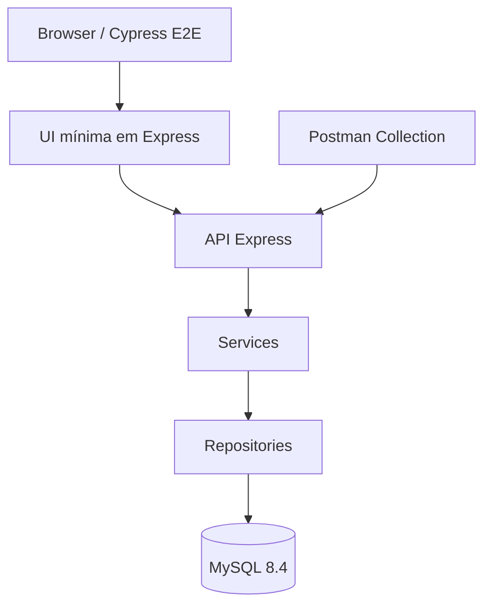
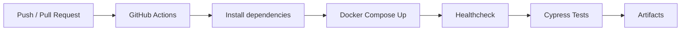

# bankqa-hermessonyuri


Projeto de portfólio desenvolvido para demonstrar práticas de QA em um sistema bancário transacional, com foco em testes de API, fluxos financeiros, automação E2E, Docker e integração contínua.

Autor: **Hermesson Yuri**  
LinkedIn: https://www.linkedin.com/in/hermesson-yuri/  
GitHub: https://github.com/hermessonyurii  

---

## About

O **bankqa-hermessonyuri** simula um sistema bancário simples com:

- cadastro de usuário
- login com JWT
- depósito
- saque
- transferência entre contas
- consulta de saldo e extrato

A proposta do projeto é validar regras de negócio críticas em um contexto financeiro, permitindo demonstrar:

- visão de risco em fluxos transacionais
- cobertura de cenários positivos e negativos
- automação de testes E2E e API
- organização de massa de dados para testes
- documentação técnica voltada para QA
- execução local com Docker
- pipeline CI com GitHub Actions

---

## Features

- API REST em Node.js + Express
- Banco MySQL com Docker
- Interface mínima para execução de fluxos E2E
- Hash de senha com bcrypt
- Autenticação com JWT
- Queries parametrizadas
- Transações financeiras com controle transacional
- Testes automatizados com Cypress
- Postman Collection pronta para importação
- Pipeline com GitHub Actions
- Documentação de QA em `/docs`

---

## Tech Stack

- **Backend:** Node.js, Express
- **Database:** MySQL 8.4
- **Tests:** Cypress, Postman
- **Containerization:** Docker, Docker Compose
- **CI/CD:** GitHub Actions
- **Language:** JavaScript

---

## Architecture



### Estrutura principal

```text
bankqa-hermessonyuri/
├── app/
├── database/
├── tests/
├── docs/
├── .github/
├── docker-compose.yml
├── package.json
├── .env.example
└── README.md
```

---

## How to Run

### 1) Clone o repositório

```bash
git clone https://github.com/hermessonyurii/bankqa-hermessonyuri.git
cd bankqa-hermessonyuri
```

### 2) Configure as variáveis de ambiente

```bash
cp .env.example .env
```

Edite o arquivo `.env` conforme necessário.

Exemplo:

```env
JWT_SECRET=your-secret-here
```

> Nunca versionar arquivos `.env` reais. O projeto mantém apenas `.env.example` como referência.

### 3) Instale as dependências

```bash
npm install
```

### 4) Suba a stack com Docker

```bash
docker compose up -d --build
```

### 5) Valide o healthcheck

```bash
curl http://localhost:3000/api/health
```

Resultado esperado:

```json
{
  "status": "ok"
}
```

---

## Running Tests

### Rodar testes E2E

```bash
npm run test:e2e
```

### Rodar testes de API

```bash
npm run test:api
```

### Abrir Cypress em modo interativo

```bash
npm run test:open
```

---

## Postman

Para executar os testes manualmente via Postman:

1. Importe a collection:

```text
tests/postman/BankQA.postman_collection.json
```

2. Importe o environment:

```text
tests/postman/BankQA.local.postman_environment.json
```

3. Configure a base URL:

```text
http://localhost:3000/api
```

4. Execute o fluxo:

```text
Health -> Register User -> Login -> Account Summary -> Deposit -> Withdraw -> Transfer
```

As rotas autenticadas exigem o header:

```text
Authorization: Bearer {{token}}
```

---

## API Endpoints

### Health

| Method | Endpoint | Auth |
|---|---|---|
| GET | `/api/health` | Não |

### Auth

| Method | Endpoint | Auth | Description |
|---|---|---|---|
| POST | `/api/auth/register` | Não | Cadastro de usuário |
| POST | `/api/auth/login` | Não | Login e geração de token JWT |

#### Register payload

```json
{
  "fullName": "Hermesson Yuri",
  "email": "hermesson.yuri.qa@example.com",
  "documentNumber": "12345678901",
  "password": "Password123!"
}
```

#### Login payload

```json
{
  "email": "hermesson.yuri.qa@example.com",
  "password": "Password123!"
}
```

### Account

| Method | Endpoint | Auth | Description |
|---|---|---|---|
| GET | `/api/account/summary` | Sim | Consulta de saldo e dados da conta |
| POST | `/api/account/deposit` | Sim | Depósito em conta |
| POST | `/api/account/withdraw` | Sim | Saque em conta |
| POST | `/api/account/transfer` | Sim | Transferência entre contas |

#### Deposit payload

```json
{
  "amount": 100,
  "description": "Depósito inicial"
}
```

#### Withdraw payload

```json
{
  "amount": 50,
  "description": "Saque teste"
}
```

#### Transfer payload

```json
{
  "destinationAccountNumber": "260000000222",
  "amount": 25,
  "description": "Transferência teste"
}
```

---

## Seed User for Tests

```json
{
  "email": "hermesson.yuri.qa@example.com",
  "password": "Password123!",
  "account": "260000000111"
}
```

Conta destino para transferência:

```text
260000000222
```

---

## Test Coverage

### E2E / UI

- cadastro de usuário
- login de usuário
- fluxo de depósito
- fluxo de saque
- fluxo de transferência
- consulta de saldo e extrato

### API

- healthcheck
- cadastro
- login
- consulta de resumo da conta
- depósito
- saque
- transferência

### Cenários negativos

- saque maior que o saldo disponível
- transferência maior que o saldo disponível
- transferência para conta inválida ou inexistente
- valores negativos
- valores zerados
- autenticação ausente
- token inválido
- dados obrigatórios ausentes

---

## CI/CD



O workflow está localizado em:

```text
.github/workflows/ci.yml
```

Badge:


---

## QA Notes

Algumas decisões técnicas foram aplicadas para reforçar a consistência dos testes e dos fluxos financeiros:

- uso de `DECIMAL(15,2)` para valores monetários
- saque e transferência com controle transacional
- uso de `FOR UPDATE` em operações críticas
- autenticação via JWT em rotas protegidas
- testes cobrindo cenário feliz, negativo e validações de regra de negócio
- UI mínima para permitir validação E2E real sem desviar o foco do objetivo principal do projeto
- Postman Collection para apoio em testes exploratórios e validação manual da API

---

## Documentation

- [Estratégia de Testes](docs/test-strategy.md)
- [Plano de Testes](docs/test-plan.md)
- [Matriz de Riscos](docs/risk-matrix.md)
- [Especificação da API](docs/api-spec.md)
- [Schema do Banco](docs/database-schema.md)
- [Casos de Teste Manuais](docs/manual-test-cases.md)
- [Evidências](docs/evidence/)
- [Troubleshooting](docs/troubleshooting.md)

---

## Troubleshooting

Problemas comuns de execução local, Docker, Cypress, Postman e ambiente estão documentados em:

```text
docs/troubleshooting.md
```

---

## Project Purpose

Este projeto foi estruturado para demonstrar habilidades práticas em QA, incluindo:

- análise de regras de negócio
- testes de API
- testes E2E
- automação com Cypress
- uso de Postman
- Docker para ambiente local
- GitHub Actions para CI
- documentação técnica
- organização de projeto para portfólio profissional

---

## Author

**Hermesson Yuri**  
QA | Testes de API | Fluxos transacionais | Automação com JavaScript

- LinkedIn: https://www.linkedin.com/in/hermesson-yuri/
- GitHub: https://github.com/hermessonyurii
- Instagram: https://www.instagram.com/hermessonyuri.yah/
