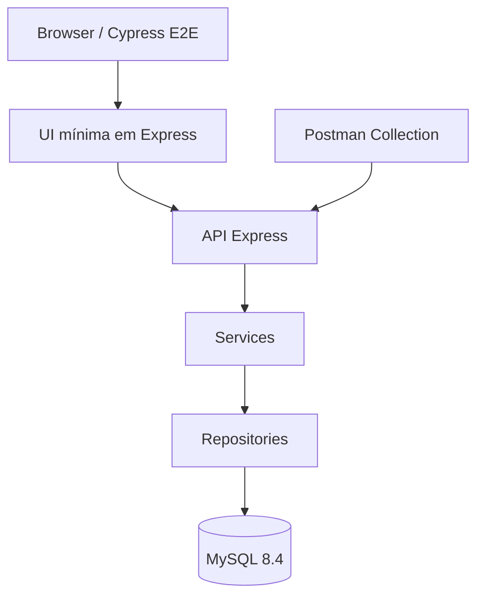
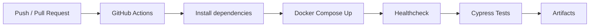

<div align="center">

# 🏦 BankQA - Sistema Bancário com Qualidade em Foco

### Sistema Bancário com Qualidade em Foco

Projeto de portfólio completo desenvolvido para demonstrar **práticas avançadas de QA**, automação de testes, backend robusto e arquitetura orientada a qualidade em um contexto de sistema financeiro transacional.

[](https://nodejs.org)
[](https://expressjs.com)
[](https://www.mysql.com)
[](https://cypress.io)
[](https://docker.com)
[](https://github.com/features/actions)

---

### 👤 Autor

**Hermesson Yuri** - QA Analyst | Automação de Testes | Qualidade de Software

[](https://www.linkedin.com/in/hermesson-yuri)
[](https://github.com/hermessonyuri)
[](https://instagram.com/hermessonyuri)
[](mailto:hermesson@email.com)

</div>

---

<div align="center">


</div>

---

## 📋 Visão Geral

O **BankQA** simula um sistema bancário moderno com funcionalidades transacionais completas, projetado com **qualidade em cada camada**:

<table>
<tr>
<td width="50%">

### ✨ Funcionalidades
- 👤 Cadastro e autenticação de usuários
- 🔐 Login seguro com JWT
- 💰 Depósito e saque
- 🔄 Transferência entre contas
- 📊 Consulta de saldo e extrato

</td>
<td width="50%">

### 🎯 Propósito
- ✅ Validar regras de negócio críticas
- 🔍 Demonstrar visão de risco em fluxos transacionais
- 🧪 Cobertura completa de cenários (positivos e negativos)
- 🤖 Automação E2E e API com Cypress
- 📈 Dados bem organizados para testes
- 🐳 Fácil execução com Docker

</td>
</tr>
</table>

---

## 🚀 Características Principais

| Categoria | Detalhe |
|-----------|---------|
| **Backend** | Node.js + Express com arquitetura em camadas |
| **Database** | MySQL 8.4 com transações e queries parametrizadas |
| **Segurança** | Hash de senha com bcrypt + Autenticação JWT |
| **Testes** | Cypress (E2E) + Postman (API) com cobertura completa |
| **Containerização** | Docker + Docker Compose para ambiente replicável |
| **CI/CD** | GitHub Actions para pipeline automatizado |
| **Interface** | UI mínima em HTML/CSS para testes E2E |
| **Documentação** | Guias detalhados de QA, arquitetura e testes |

---

## 💻 Stack Tecnológico

```
┌─────────────────────────────────────────────────────────────┐
│                                                               │
│  🎨 FRONTEND              🔌 BACKEND              💾 DATABASE │
│  ├─ HTML5                 ├─ Node.js 22           └─ MySQL 8.4│
│  ├─ CSS3                  ├─ Express 4            │           │
│  └─ JavaScript            ├─ JWT Auth             └─ Queries  │
│                           └─ Bcrypt (Hash)           Param.   │
│                                                               │
│  🧪 TESTING               📦 DEVOPS               🔄 CI/CD    │
│  ├─ Cypress E2E           ├─ Docker               └─ GitHub   │
│  ├─ Postman               └─ Docker Compose          Actions  │
│  └─ Unit Tests                                                │
│                                                               │
└─────────────────────────────────────────────────────────────┘
```

---

## Architecture



### Estrutura principal

```text
bankqa-hermessonyuri/
├── app/
├── database/
├── tests/
├── docs/
├── .github/
├── docker-compose.yml
├── package.json
├── .env.example
└── README.md
```

---

## ⚡ Quick Start

### 📋 Pré-requisitos

- `docker` e `docker-compose`
- `node` v18+
- `npm` ou `yarn`

### 🛠️ Instalação e Execução

#### 1️⃣ Clone o repositório

```bash
git clone https://github.com/hermessonyuri/bankqa-hermessonyuri.git
cd bankqa-hermessonyuri
```

#### 2️⃣ Configure variáveis de ambiente

```bash
cp .env.example .env
```

Edite o arquivo `.env` conforme necessário:

```env
JWT_SECRET=your-super-secret-key
DATABASE_HOST=mysql
DATABASE_USER=root
DATABASE_PASSWORD=password
DATABASE_NAME=bankqa_db
```

#### 3️⃣ Instale dependências

```bash
npm install
```

#### 4️⃣ Suba a stack com Docker

```bash
docker compose up -d --build
```

#### 5️⃣ Valide o healthcheck

```bash
curl http://localhost:3000/api/health
```

✅ Resposta esperada:

```json
{
  "status": "ok",
  "timestamp": "2026-05-09T10:30:00.000Z"
}
```

---

## ✅ Executar Testes

### 🎬 Cypress E2E

```bash
# Rodar todos os testes E2E em modo headless
npm run test:e2e

# Abrir Cypress Dashboard (modo interativo)
npm run test:open
```

### 🧪 Testes de API

```bash
# Executar suite de testes da API
npm run test:api
```

### 📊 Cobertura Esperada

- ✅ Fluxos positivos (happy path)
- ✅ Validações e regras de negócio
- ✅ Cenários de erro
- ✅ Segurança (JWT, autenticação)
- ✅ Integridade de dados

---

## 📮 Postman Collection

Para testes manuais ou integração com pipelines:

1. **Importe a Collection:**
   ```
   tests/postman/BankQA.postman_collection.json
   ```

2. **Importe o Environment:**
   ```
   tests/postman/BankQA.local.postman_environment.json
   ```

3. **Configure a Base URL:**
   ```
   http://localhost:3000/api
   ```

4. **Fluxo de Testes Recomendado:**
   ```
   Health → Register User → Login → Account Summary 
   → Deposit → Withdraw → Transfer → Transaction History
   ```

> 💡 **Dica:** Rotas autenticadas exigem o header `Authorization: Bearer {token}`

---

```text
Authorization: Bearer {{token}}
```

---

## 🔌 API Endpoints

### ✅ Health Check

| Method | Endpoint | Autenticação |
|--------|----------|--------------|
| GET | `/api/health` | ❌ Não |

### 🔐 Autenticação

| Method | Endpoint | Autenticação | Descrição |
|--------|----------|--------------|-----------|
| POST | `/api/auth/register` | ❌ Não | Criar nova conta |
| POST | `/api/auth/login` | ❌ Não | Gerar JWT Token |

**Payload - Registro:**
```json
{
  "fullName": "Hermesson Yuri",
  "email": "hermesson.yuri.qa@example.com",
  "documentNumber": "12345678901",
  "password": "Password123!"
}
```

**Payload - Login:**
```json
{
  "email": "hermesson.yuri.qa@example.com",
  "password": "Password123!"
}
```

### 💰 Operações de Conta

| Method | Endpoint | Autenticação | Descrição |
|--------|----------|--------------|-----------|
| GET | `/api/account/summary` | ✅ Sim | Saldo e dados da conta |
| POST | `/api/account/deposit` | ✅ Sim | Depositar valores |
| POST | `/api/account/withdraw` | ✅ Sim | Sacar valores |
| POST | `/api/account/transfer` | ✅ Sim | Transferir entre contas |

**Payload - Depósito:**
```json
{
  "amount": 100.00,
  "description": "Depósito inicial"
}
```

**Payload - Saque:**
```json
{
  "amount": 50.00,
  "description": "Saque teste"
}
```

**Payload - Transferência:**
```json
{
  "destinationAccountNumber": "260000000222",
  "amount": 25.00,
  "description": "Transferência teste"
}
```

---

## 👤 Usuário de Teste

```json
{
  "email": "hermesson.yuri.qa@example.com",
  "password": "Password123!",
  "account": "260000000111"
}
```

**Conta para transferência:** `260000000222`

---

## 🧪 Cobertura de Testes

### E2E / UI

- cadastro de usuário
- login de usuário
- fluxo de depósito
- fluxo de saque
- fluxo de transferência
- consulta de saldo e extrato

### API

- healthcheck
- cadastro
- login
- consulta de resumo da conta
- depósito
- saque
- transferência

### Cenários negativos

- saque maior que o saldo disponível
- transferência maior que o saldo disponível
- transferência para conta inválida ou inexistente
- valores negativos
- valores zerados
- autenticação ausente
- token inválido
- dados obrigatórios ausentes

---

## CI/CD



O workflow está localizado em:

```text
.github/workflows/ci.yml
```

Badge:


---

## QA Notes

Algumas decisões técnicas foram aplicadas para reforçar a consistência dos testes e dos fluxos financeiros:

- uso de `DECIMAL(15,2)` para valores monetários
- saque e transferência com controle transacional
- uso de `FOR UPDATE` em operações críticas
- autenticação via JWT em rotas protegidas
- testes cobrindo cenário feliz, negativo e validações de regra de negócio
- UI mínima para permitir validação E2E real sem desviar o foco do objetivo principal do projeto
- Postman Collection para apoio em testes exploratórios e validação manual da API

---

## Documentation

- [Estratégia de Testes](docs/test-strategy.md)
- [Plano de Testes](docs/test-plan.md)
- [Matriz de Riscos](docs/risk-matrix.md)
- [Especificação da API](docs/api-spec.md)
- [Schema do Banco](docs/database-schema.md)
- [Casos de Teste Manuais](docs/manual-test-cases.md)
- [Evidências](docs/evidence/)
- [Troubleshooting](docs/troubleshooting.md)

---

## Troubleshooting

Problemas comuns de execução local, Docker, Cypress, Postman e ambiente estão documentados em:

```text
docs/troubleshooting.md
```

---

## Project Purpose

Este projeto foi estruturado para demonstrar habilidades práticas em QA, incluindo:

- análise de regras de negócio
- testes de API
- testes E2E
- automação com Cypress
- uso de Postman
- Docker para ambiente local
- GitHub Actions para CI
- documentação técnica
- organização de projeto para portfólio profissional

---

## 👨‍💼 Sobre o Autor

**Hermesson Yuri**  
QA Analyst | Automação de Testes | Fluxos Transacionais | JavaScript

- **LinkedIn:** https://www.linkedin.com/in/hermesson-yuri/
- **GitHub:** https://github.com/hermessonyuri
- **Instagram:** https://www.instagram.com/hermessonyuri.yah/
