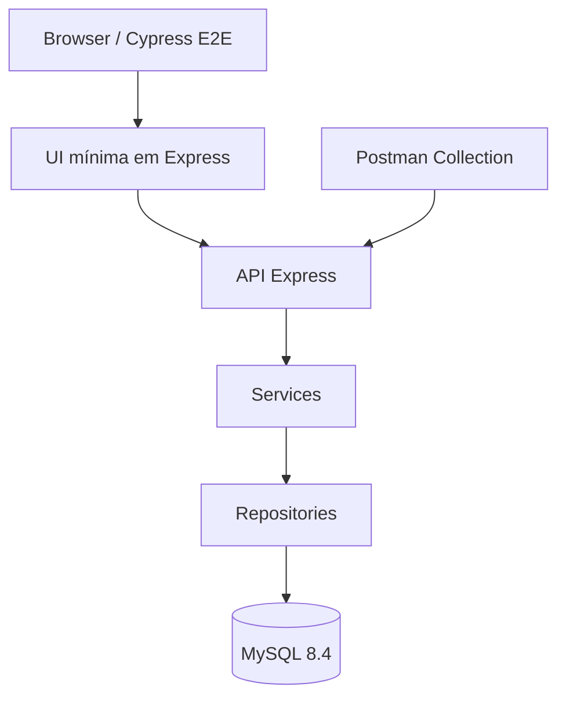
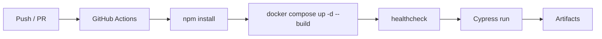

# bankqa-hermessonyuri-portfolio


Projeto de portfólio criado para demonstrar minha atuação em QA com foco em sistema transacional, testes de API, fluxos financeiros e automação com JavaScript.

Autor: **Hermesson Yuri**  
LinkedIn: https://www.linkedin.com/in/hermesson-yuri/  
GitHub: https://github.com/hermessonyurii  

---

## About

O **bankqa-hermessonyuri-portfolio** simula um sistema bancário simples com:
- cadastro de usuário
- login com JWT
- depósito
- saque
- transferência entre contas
- extrato

A proposta aqui não foi fazer um banco "bonito". O foco foi montar um sistema pequeno, mas com regras de negócio claras o suficiente para um QA demonstrar:
- visão de risco
- cobertura de cenário feliz e negativo
- organização de automação
- leitura de fluxo transacional

---

## Features

- API REST em Node.js + Express
- Banco MySQL com Docker
- UI mínima para cobrir E2E real
- Hash de senha com bcrypt
- JWT para autenticação
- Queries parametrizadas
- Transações financeiras com controle transacional
- Cypress para E2E e API testing
- Postman collection pronta para importar
- Pipeline com GitHub Actions

---

## Tech Stack

- **Backend:** Node.js, Express
- **Database:** MySQL 8.4
- **Tests:** Cypress, Postman
- **Containerization:** Docker, Docker Compose
- **CI/CD:** GitHub Actions

---

## Architecture



### Estrutura principal

```text
bankqa-hermessonyuri-portfolio/
├── app/
├── database/
├── tests/
├── docs/
├── .github/
├── docker-compose.yml
└── README.md
```

---

## How to Run

### 1) Setup Local
```bash
# Clone o repositório
git clone https://github.com/hermessonyurii/bankqa-hermessonyuri-portfolio.git
cd bankqa-hermessonyuri-portfolio

# Copie o arquivo de exemplo de variáveis de ambiente
cp .env.example .env

# Edite .env com valores reais (mantenha JWT_SECRET secreto)
# Exemplo:
# JWT_SECRET=your-secret-here

# Instale dependências
npm install
```

### 2) Subir a stack com Docker
```bash
docker compose up --build
```

### 3) Instalar dependências do workspace
```bash
npm install
```

### 4) Rodar os testes E2E
```bash
npm run test:e2e
```

### 5) Abrir Cypress em modo interativo
```bash
npm run test:open
```

### 6) Usar Postman
- Importe `tests/postman/BankQA.postman_collection.json`
- Configure ambiente com `tests/postman/BankQA.local.postman_environment.json`
- Base URL: `http://localhost:3000/api`

---

## API Endpoints

### Health
- `GET /api/health`

### Auth
- `POST /api/auth/register`
  - Payload: `{ "fullName": "string", "email": "string", "documentNumber": "string", "password": "string" }`
- `POST /api/auth/login`
  - Payload: `{ "email": "string", "password": "string" }`

### Account (Autenticado)
- `GET /api/account/summary`
- `POST /api/account/deposit`
  - Payload: `{ "amount": number, "description": "string" }`
- `POST /api/account/withdraw`
  - Payload: `{ "amount": number, "description": "string" }`
- `POST /api/account/transfer`
  - Payload: `{ "destinationAccountNumber": "string", "amount": number, "description": "string" }`

---

## Seed user for tests

```json
{
  "email": "hermesson.yuri.qa@example.com",
  "password": "Password123!",
  "account": "260000000111"
}
```

Conta destino para transferência:
```text
260000000222
```

---

## Test Coverage

### E2E / UI
- user registration
- user login
- deposit flow
- withdraw flow
- transfer flow
- statement flow

### API / health
- healthcheck endpoint
- auth endpoints (register, login)
- account endpoints (summary, deposit, withdraw, transfer)

### Negativos
- saque maior que saldo
- transferência inválida
- valores negativos

### Postman
A collection exportada está em:

```text
tests/postman/BankQA.postman_collection.json
```

---

## CI/CD



O workflow fica em:
```text
.github/workflows/ci.yml
```

Badge: 

---

## Observações de QA

Algumas decisões foram intencionais para dar mais consistência ao projeto:

- usei `DECIMAL(15,2)` para saldo e movimentação
- saque e transferência usam transação com `FOR UPDATE`
- o login automático em alguns testes reduz ruído quando o foco do cenário é saldo ou extrato
- a UI é mínima de propósito, porque o objetivo aqui é validar regra e fluxo, e sem contar que estou aprendendo muita coisa.
---

## Troubleshooting

Verifique `docs/troubleshooting.md` para problemas comuns.

---

## Documentação

- [Estratégia de Testes](docs/test-strategy.md)
- [Plano de Testes](docs/test-plan.md)
- [Matriz de Riscos](docs/risk-matrix.md)
- [Especificação da API](docs/api-spec.md)
- [Schema do Banco](docs/database-schema.md)
- [Casos de Teste Manuais](docs/manual-test-cases.md)
- [Evidências](docs/evidence/)

---

## Author

**Hermesson Yuri**  
QA | Testes de API | Fluxos transacionais | Automação com JavaScript

- LinkedIn: https://www.linkedin.com/in/hermesson-yuri/
- GitHub: https://github.com/hermessonyurii
- Instagram: https://www.instagram.com/hermessonyuri.yah/
