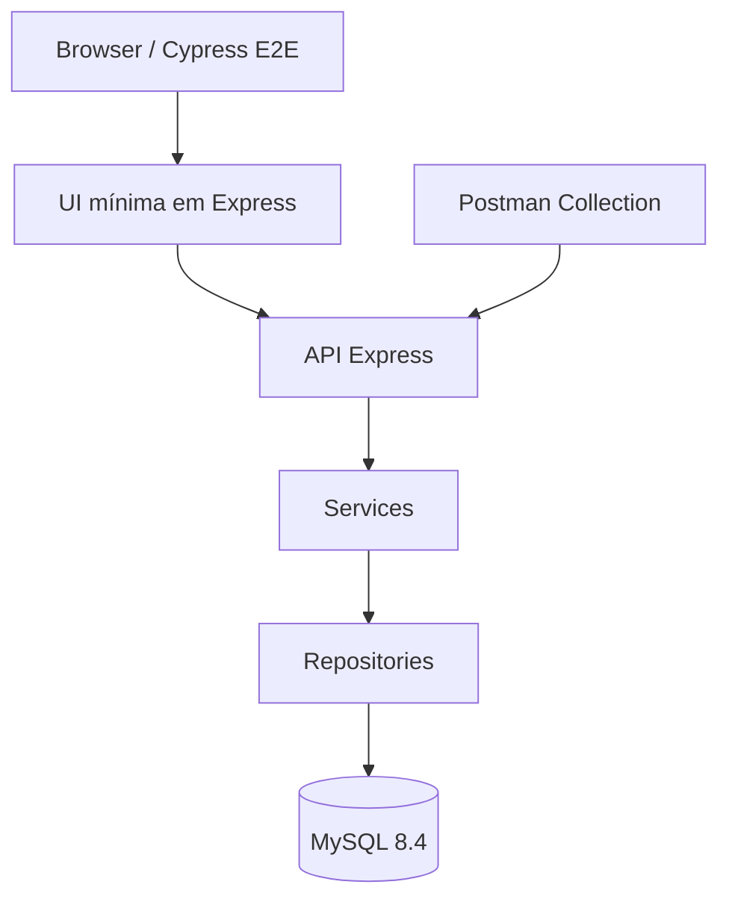
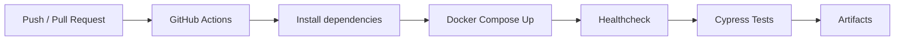

<div align="center">

# 🏦 BankQA - Sistema Bancário com Qualidade em Foco

### Sistema Bancário com Qualidade em Foco

Projeto de portfólio completo desenvolvido para demonstrar **práticas avançadas de QA**, automação de testes, backend robusto e arquitetura orientada a qualidade em um contexto de sistema financeiro transacional.

[](https://nodejs.org)
[](https://expressjs.com)
[](https://www.mysql.com)
[](https://cypress.io)
[](https://docker.com)
[](https://github.com/features/actions)

---

### 👤 Autor

**Hermesson Yuri** - QA Analyst | Automação de Testes | Qualidade de Software

[](https://www.linkedin.com/in/hermesson-yuri)
[](https://github.com/hermessonyurii)
[](https://instagram.com/hermessonyuri.yah)
</div>

---

<div align="center">


</div>

---

<div align="center">

<h2>📋 Visão Geral</h2>

O **BankQA** é um projeto de portfólio que simula um sistema bancário transacional, desenvolvido para demonstrar práticas de **QA, automação de testes, validação de API, fluxos financeiros e integração contínua**.

A proposta é validar regras de negócio críticas em um ambiente simples, porém estruturado, permitindo demonstrar visão de risco, organização técnica e capacidade de automação.

---

<table>
  <tr>
    <td width="50%" valign="top">

### ✨ Funcionalidades

- 👤 Cadastro de usuários
- 🔐 Login com autenticação JWT
- 💰 Depósito em conta
- ➖ Saque com validação de saldo
- 🔄 Transferência entre contas
- 📊 Consulta de saldo e extrato

    </td>
    <td width="50%" valign="top">

### 🎯 Objetivo

- ✅ Validar regras financeiras críticas
- 🔍 Cobrir cenários positivos e negativos
- 🧪 Automatizar testes E2E e API
- 📬 Apoiar testes manuais com Postman
- 🐳 Executar ambiente com Docker
- ⚙️ Rodar pipeline com GitHub Actions

    </td>
  </tr>
</table>
</div>

<div align="center">

## 🧰 Stack Tecnológico

<table>
  <tr>
    <td width="33%" valign="top">

### 🎨 Frontend

- HTML5
- CSS3
- JavaScript

    </td>
    <td width="33%" valign="top">

### 🧠 Backend

- Node.js 22
- Express 4
- JWT Auth
- bcrypt

    </td>
    <td width="33%" valign="top">

### 🗄️ Database

- MySQL 8.4
- Queries parametrizadas
- Transações financeiras

    </td>
  </tr>
  <tr>
    <td width="33%" valign="top">

### 🧪 Testing

- Cypress E2E
- Cypress API
- Postman

    </td>
    <td width="33%" valign="top">

### 🐳 DevOps

- Docker
- Docker Compose
- Ambiente local reproduzível

    </td>
    <td width="33%" valign="top">

### ⚙️ CI/CD

- GitHub Actions
- Pipeline automatizado
- Execução em push/PR

    </td>
  </tr>
</table>
</div>

---
<div align="center">

## 🚀 Características Principais

O **BankQA** foi desenvolvido para simular um fluxo bancário transacional com foco em qualidade, rastreabilidade e validação automatizada.

</div>
<table>
  <tr>
    <td width="50%" valign="top">

### 🧠 Backend
API REST com **Node.js** e **Express**, organizada em camadas para separar rotas, controllers, services e repositories.

**Demonstra:** arquitetura simples, clara e manutenível.
</td>

<td width="50%" valign="top">

### 🗄️ Banco de Dados
Uso de **MySQL 8.4**, queries parametrizadas e controle transacional em operações financeiras.

**Demonstra:** consistência, integridade e segurança nos dados.
 </td>
</tr>
  <tr>
   
<td width="50%" valign="top">

### 🔐 Segurança
Autenticação com **JWT** e hash de senha com **bcrypt**.

**Demonstra:** proteção de credenciais e controle de acesso em rotas privadas.

  </td>
    <td width="50%" valign="top">

### 🧪 Testes
Cobertura com **Cypress E2E**, testes de API e **Postman Collection**.

**Demonstra:** validação de fluxos críticos, cenários positivos e negativos.

</td>
  </tr>
  <tr>
    <td width="50%" valign="top">

### 🐳 Ambiente
Execução com **Docker** e **Docker Compose**.

**Demonstra:** ambiente local padronizado, replicável e simples de subir.
  </td>
    <td width="50%" valign="top">

### ⚙️ CI/CD
Pipeline automatizado com **GitHub Actions**.

**Demonstra:** validação contínua do projeto em push e pull request.

</td>
  </tr>
  <tr>
    <td width="50%" valign="top">

### 🖥️ Interface
UI mínima com **HTML, CSS e JavaScript** para execução de testes E2E.

**Demonstra:** suporte real aos fluxos automatizados sem excesso visual.

 </td>
    <td width="50%" valign="top">

### 📚 Documentação
Documentos de API, banco, plano de testes, estratégia, riscos e evidências.

**Demonstra:** organização técnica e maturidade em QA.

 </td>
  </tr>
</table>

---
<div align="center">

## 💻 Stack Tecnológico

</div>

<p align="center">
  O projeto utiliza uma stack voltada para desenvolvimento backend, automação de testes, ambiente containerizado e integração contínua.
</p>

<br />

<div align="center">

<table>
  <tr>
    <td align="center" width="50">
      
      <br />
      <sub><strong>HTML5</strong></sub>
    </td>
    <td align="center" width="50">
      
      <br />
      <sub><strong>CSS3</strong></sub>
    </td>
    <td align="center" width="50">
      
      <br />
      <sub><strong>JavaScript</strong></sub>
    </td>
    <td align="center" width="50">
      
      <br />
      <sub><strong>Node.js</strong></sub>
    </td>
    <td align="center" width="50">
      
      <br />
      <sub><strong>Express</strong></sub>
    </td>
    <td align="center" width="50">
      
      <br />
      <sub><strong>MySQL</strong></sub>
    </td>
    <td align="center" width="50">
      
      <br />
      <sub><strong>Postman</strong></sub>
    </td>
    <td align="center" width="50">
      
      <br />
      <sub><strong>Cypress</strong></sub>
    </td>
    <td align="center" width="50">
      
      <br />
      <sub><strong>Docker</strong></sub>
    </td>
    <td align="center" width="50">
      
      <br />
      <sub><strong>Actions</strong></sub>
    </td>
  </tr>
</table>

</div>

---
<div align="center">

## Architecture

</div>



### Estrutura principal

```text
bankqa-hermessonyuri/
├── app/
├── database/
├── tests/
├── docs/
├── .github/
├── docker-compose.yml
├── package.json
├── .env.example
└── README.md
```

---

## ⚡ Quick Start

### 📋 Pré-requisitos

- `docker` e `docker-compose`
- `node` v18+
- `npm` ou `yarn`

### 🛠️ Instalação e Execução

#### 1️⃣ Clone o repositório

```bash
git clone https://github.com/hermessonyuri/bankqa-hermessonyuri.git
cd bankqa-hermessonyuri
```

#### 2️⃣ Configure variáveis de ambiente

```bash
cp .env.example .env
```

Edite o arquivo `.env` conforme necessário:

```env
JWT_SECRET=your-super-secret-key
DATABASE_HOST=mysql
DATABASE_USER=root
DATABASE_PASSWORD=password
DATABASE_NAME=bankqa_db
```

#### 3️⃣ Instale dependências

```bash
npm install
```

#### 4️⃣ Suba a stack com Docker

```bash
docker compose up -d --build
```

#### 5️⃣ Valide o healthcheck

```bash
curl http://localhost:3000/api/health
```

✅ Resposta esperada:

```json
{
  "status": "ok",
  "timestamp": "2026-05-09T10:30:00.000Z"
}
```

---

## ✅ Executar Testes

### 🎬 Cypress E2E

```bash
# Rodar todos os testes E2E em modo headless
npm run test:e2e

# Abrir Cypress Dashboard (modo interativo)
npm run test:open
```

### 🧪 Testes de API

```bash
# Executar suite de testes da API
npm run test:api
```

### 📊 Cobertura Esperada

- ✅ Fluxos positivos (happy path)
- ✅ Validações e regras de negócio
- ✅ Cenários de erro
- ✅ Segurança (JWT, autenticação)
- ✅ Integridade de dados

---

## 📮 Postman Collection

Para testes manuais ou integração com pipelines:

1. **Importe a Collection:**
   ```
   tests/postman/BankQA.postman_collection.json
   ```

2. **Importe o Environment:**
   ```
   tests/postman/BankQA.local.postman_environment.json
   ```

3. **Configure a Base URL:**
   ```
   http://localhost:3000/api
   ```

4. **Fluxo de Testes Recomendado:**
   ```
   Health → Register User → Login → Account Summary 
   → Deposit → Withdraw → Transfer → Transaction History
   ```

> 💡 **Dica:** Rotas autenticadas exigem o header `Authorization: Bearer {token}`

---

```text
Authorization: Bearer {{token}}
```

---

## 🔌 API Endpoints

### ✅ Health Check

| Method | Endpoint | Autenticação |
|--------|----------|--------------|
| GET | `/api/health` | ❌ Não |

### 🔐 Autenticação

| Method | Endpoint | Autenticação | Descrição |
|--------|----------|--------------|-----------|
| POST | `/api/auth/register` | ❌ Não | Criar nova conta |
| POST | `/api/auth/login` | ❌ Não | Gerar JWT Token |

**Payload - Registro:**
```json
{
  "fullName": "Hermesson Yuri",
  "email": "hermesson.yuri.qa@example.com",
  "documentNumber": "12345678901",
  "password": "Password123!"
}
```

**Payload - Login:**
```json
{
  "email": "hermesson.yuri.qa@example.com",
  "password": "Password123!"
}
```

### 💰 Operações de Conta

| Method | Endpoint | Autenticação | Descrição |
|--------|----------|--------------|-----------|
| GET | `/api/account/summary` | ✅ Sim | Saldo e dados da conta |
| POST | `/api/account/deposit` | ✅ Sim | Depositar valores |
| POST | `/api/account/withdraw` | ✅ Sim | Sacar valores |
| POST | `/api/account/transfer` | ✅ Sim | Transferir entre contas |

**Payload - Depósito:**
```json
{
  "amount": 100.00,
  "description": "Depósito inicial"
}
```

**Payload - Saque:**
```json
{
  "amount": 50.00,
  "description": "Saque teste"
}
```

**Payload - Transferência:**
```json
{
  "destinationAccountNumber": "260000000222",
  "amount": 25.00,
  "description": "Transferência teste"
}
```

---

## 👤 Usuário de Teste

```json
{
  "email": "hermesson.yuri.qa@example.com",
  "password": "Password123!",
  "account": "260000000111"
}
```

**Conta para transferência:** `260000000222`

---

## 🧪 Cobertura de Testes

### E2E / UI

- cadastro de usuário
- login de usuário
- fluxo de depósito
- fluxo de saque
- fluxo de transferência
- consulta de saldo e extrato

### API

- healthcheck
- cadastro
- login
- consulta de resumo da conta
- depósito
- saque
- transferência

### Cenários negativos

- saque maior que o saldo disponível
- transferência maior que o saldo disponível
- transferência para conta inválida ou inexistente
- valores negativos
- valores zerados
- autenticação ausente
- token inválido
- dados obrigatórios ausentes

---
<div align="center">

## CI/CD
</div>



O workflow está localizado em:

```text
.github/workflows/ci.yml
```

Badge:


---

## QA Notes

Algumas decisões técnicas foram aplicadas para reforçar a consistência dos testes e dos fluxos financeiros:

- uso de `DECIMAL(15,2)` para valores monetários
- saque e transferência com controle transacional
- uso de `FOR UPDATE` em operações críticas
- autenticação via JWT em rotas protegidas
- testes cobrindo cenário feliz, negativo e validações de regra de negócio
- UI mínima para permitir validação E2E real sem desviar o foco do objetivo principal do projeto
- Postman Collection para apoio em testes exploratórios e validação manual da API

---

## Documentation

- [Estratégia de Testes](docs/test-strategy.md)
- [Plano de Testes](docs/test-plan.md)
- [Matriz de Riscos](docs/risk-matrix.md)
- [Especificação da API](docs/api-spec.md)
- [Schema do Banco](docs/database-schema.md)
- [Casos de Teste Manuais](docs/manual-test-cases.md)
- [Evidências](docs/evidence/)
- [Troubleshooting](docs/troubleshooting.md)

---

## Troubleshooting

Problemas comuns de execução local, Docker, Cypress, Postman e ambiente estão documentados em:

```text
docs/troubleshooting.md
```

---

## Project Purpose

Este projeto foi estruturado para demonstrar habilidades práticas em QA, incluindo:

- análise de regras de negócio
- testes de API
- testes E2E
- automação com Cypress
- uso de Postman
- Docker para ambiente local
- GitHub Actions para CI
- documentação técnica
- organização de projeto para portfólio profissional

---

<div align="center">

## 🤝 Uso do Projeto e Créditos

Este projeto foi desenvolvido com dedicação e muito esforço, horas de sono "perdidas" para servir como portfólio, estudo e referência prática para mim e claro para os profissionais que desejam evoluir na área de **Qualidade de Software**.

Sinta-se à vontade para estudar, clonar, adaptar e utilizar este projeto como base para seus próprios aprendizados.

Ao utilizar este material como referência, peço apenas que mantenha os devidos créditos ao autor e indique meu LinkedIn:

**Hermesson Yuri**  
[linkedin.com/in/hermesson-yuri](https://www.linkedin.com/in/hermesson-yuri)

Reconhecer a origem de um projeto fortalece a comunidade, valoriza o trabalho de quem compartilha conhecimento e incentiva mais pessoas a contribuírem com materiais de qualidade.

---

## E para Futuros QA's:

Se você está começando na área de QA, lembre-se:

**Qualidade não é apenas encontrar bugs.**  
Qualidade é entender o negócio, pensar em riscos, questionar cenários, validar comportamentos e ajudar a entregar software com mais confiança.

Cada teste escrito, cada cenário analisado e cada erro documentado faz parte da sua evolução profissional.

No dia **01/12/2025**, tudo começou em minha vida como QA. Eu não fazia ideia do que realmente era essa área. Já tinha ouvido falar, mas achava que QA era apenas ficar encontrando “bugs”. Quando iniciei como **Estagiário de QA de Software**, percebi que a realidade era muito maior.
Cometi erros, sim. Falhei algumas vezes, mas não desisti. Eu me dediquei, procurei ajuda dos devs e tive o apoio de uma pessoa que faço questão de citar aqui: **Attus**.
Esse cara me ajudou a me tornar quem estou me tornando hoje. Ele se tornou como um irmão para mim. Me deu várias dicas, me ensinou regras, me mostrou formas melhores de agir, de me comportar profissionalmente e até de reagir diante dos erros.
Não sinto vergonha de falar isso, porque é errando que se aprende. Melhor ainda é aprender antes de errar, mas os nossos erros também nos fortalecem. E o Attus me ajudou a enxergar esse mundo de uma forma diferente.
Por que estou dizendo isso?
Porque quero que você saiba: se você pensa que vai fazer tudo sozinho, provavelmente não irá muito longe. Não tenha medo. Não sinta vergonha. Peça ajuda, corra atrás, estude, pratique e esteja disposto a aprender.
É isso que vai fazer você evoluir e chegar ao sucesso. Então:

Continue estudando, praticando e construindo projetos reais.  
A consistência sempre vence a pressa.

**Teste com propósito. Documente com clareza. Evolua todos os dias.**

</div>
